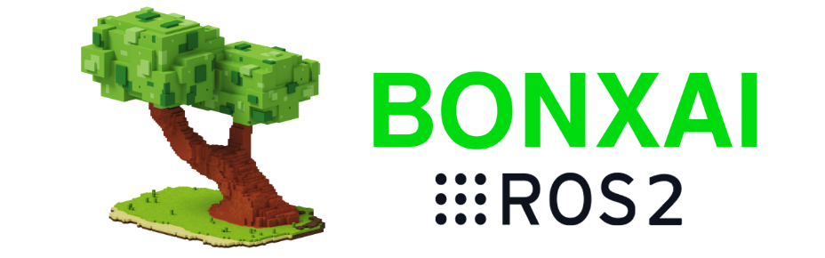
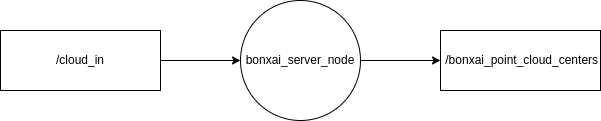

# 1. Installation

1. Navigate towards your workspace `src` folder 
```bash
cd ~/ws_bonxai/src
```
2. Git clone the Bonxai package
```bash
git clone https://github.com/facontidavide/Bonxai.git -b ros2
```
3. Go back to your `ws_bonxai` and build
```bash
cd ~/ws_bonxai && colcon build --packages-select bonxai_ros --symlink-install
```
4. Source your workspace setub.bash file

```bash
source ~/ws_bonxai/install/setup.bash
```

# 2. Basic Usage

The Bonxai Server Node is launched with the following command, for basic deployment with a minimal number of tunnable parameters:

```bash
ros2 launch bonxai_ros bonxai_mapping.launch.xml
```

There is another launch file that allows you to modify all the available parameters within the params/bonxai_params.yaml and launch the bonxai_server_node along RViz2.

```bash
ros2 launch bonxai_ros bonxai_mapping.launch.py
```

<p align="center">
  
</p>

# 3. ROS2 node API

<p align="center">
  
</p>

## 3.1 Bonxai Server

octomap_server builds and distributes volumetric 3D occupancy maps as OctoMap binary stream and in various ROS-compatible formats e.g. for obstacle avoidance or visualization. The map can be a static OctoMap .bt file (as command line argument) or can be incrementally built from incoming range data (as PointCloud2). octomap_server starts with an empty map if no command line argument is given. In general, octomap_server creates and publishes only on topics that are subscribed. Since some can be time-consuming to build for large maps, only subscribe to topics you absolutely need (e.g. in RViz) and set the "latch" parameter for false when building maps.

## 3.1.1 Subscribed Topics

 `cloud_in (sensor_msgs/msg/PointCloud2)` 

Incoming 3D point cloud for scan integration. You need to remap this topic to your sensor data and provide a tf transform between the sensor data and the static map frame. The frame_id of the point cloud has to be the sensor frame. Raytracing (clearing of free space) is always done from the origin of this frame at the time of the point cloud.


## 3.1.2 Published Topics

`occupied_voxel_vis_array (visualization_msgs/msg/Marker)`

All occupied voxels as "box" markers for visualization in RViz. Be sure to subscribe to the topic occupied_cells_vis in RViz!

`octomap_point_cloud_centers (sensor_msgs/msg/PointCloud2)`

The centers of all occupied voxels as point cloud, useful for visualization. Note that this will have gaps as the points have no volumetric size and OctoMap voxels can have different resolutions! Use the MarkerArray topic instead.

## 3.1.3 Parameters

`~reset (std_srvs/srv/Empty)`
Resets the complete map

## 3.1.4 Parameters

`~frame_id (string, default: /map)`

Static global frame in which the map will be published. A transform from sensor data to this frame needs to be available when dynamically building maps.

`~resolution (float, default: 0.05)`

Resolution in meter for the map when starting with an empty map. Otherwise the loaded file's resolution is used.

`~base_frame_id (string, default: base_footprint)`

The robot's base frame in which ground plane detection is performed (if enabled)

`~sensor_model/max_range (float, default: -1 (unlimited))`

Maximum range in meter for inserting point cloud data when dynamically building a map. Limiting the range to something useful (e.g. 5m) prevents spurious erroneous points far away from the robot.

`~sensor_model/[hit|miss] (float, default: 0.7 / 0.4)`

Probabilities for hits and misses in the sensor model when dynamically building a map

`~sensor_model/[min|max] (float, default: 0.12 / 0.97)`

Minimum and maximum probability for clamping when dynamically building a map

`~latch (bool, default: True for a static map, false if no initial map is given)`

Whether topics are published latched or only once per change. For maximum performance when building a map (with frequent updates), set to false. When set to true, on every map change all topics and visualizations will be created.

`~point_cloud_[min|max]_z (float, default: -/+ infinity)`

Minimum and maximum height of points to consider for insertion in the callback. Any point outside of this intervall will be discarded before running any insertion or ground plane filtering. You can do a rough filtering based on height with this, but if you enable the ground_filter this interval needs to include the ground plane.

`~occupancy_[min|max]_z (float, default: -/+ infinity)`

Minimum and maximum height of occupied cells to be consider in the final map. This ignores all occupied voxels outside of the interval when sending out visualizations and collision maps, but will not affect the actual octomap representation.

## 3.1.5 Required tf Transforms

`sensor data frame → /map (static world frame, changeable with parameter frame_id)`

Required transform of sensor data into the global map frame if you do scan integration. This information needs to be available from an external SLAM or localization node.